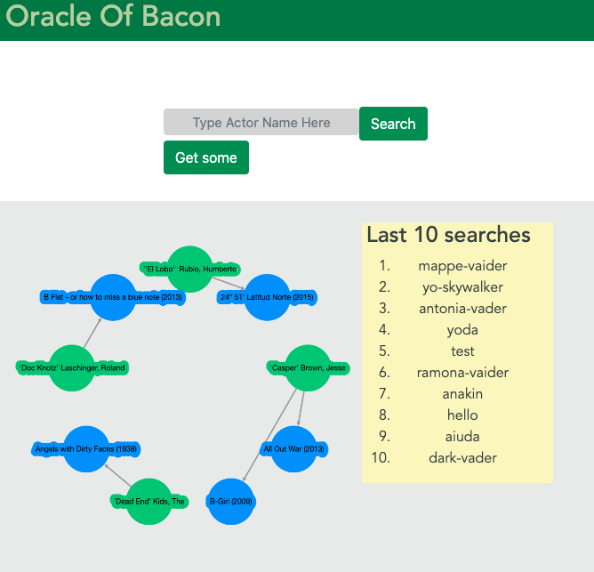

### Oracle Bacon
Some project which uses 
- Elastic search
- Neo4j
- Redis




#### Instructions


```sh
cd oracle-of-bacon-frontend
npm install
npm run dev
```

```sh
cd oracle-of-bacon-backend
./gradlew run
```

#### Configurations

- To load the datasets in neo4j peruse the document oracle-of-bacon-backend/instructions-neo4j.md
- Load the data in elastic search with index name suggestions
- Start ( Redis, Neo4j, Elastic Search)


#### Authors
- Guillem Sanyas and Daniel Santos
